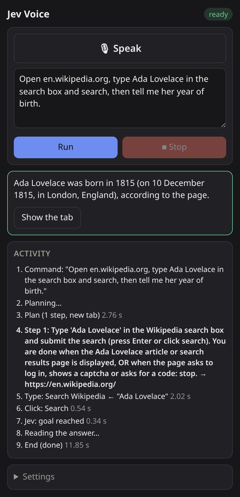
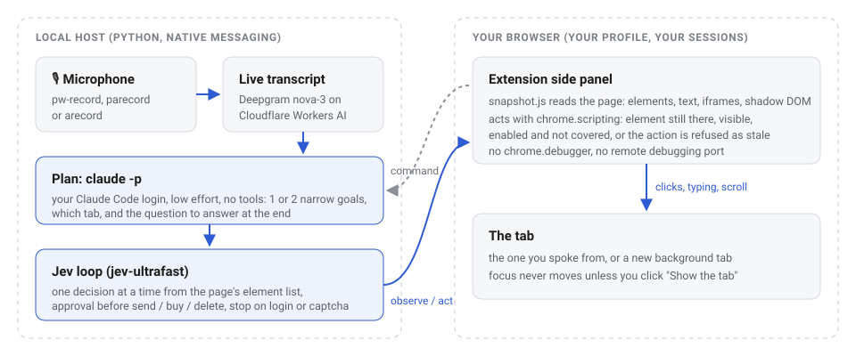

<p align="center"></p>

<h1 align="center">Jev Voice</h1>

<p align="center"><b>Talk to your browser and it does the task, in your own profile, signed in to your own accounts.</b><br>
Claude plans the command, <a href="https://github.com/browser-use/jev-ultrafast">Jev</a> carries it out one action at a time,
and a small extension does the clicking.<br>No <code>chrome.debugger</code>, no remote-debugging port, no focus stealing.</p>

<p align="center"></p>

## What it does

You say (or type) *"open Wikipedia, search for Ada Lovelace and tell me her year of birth"*. In 9 to 19 seconds (see Measured):

1. **Transcribe**: your words appear in the panel while you speak (Deepgram nova-3 on Cloudflare Workers AI, live).
2. **Plan**: `claude -p` turns the command into one or two narrow goals, picks the tab (the one you spoke from, or
   a new background tab), and notes the question to answer at the end.
3. **Act**: for each goal, Jev reads the page as a list of elements and picks one action at a time: click, type,
   select, scroll. The extension performs it in the page.
4. **Answer**: if you asked for information, Claude reads the final page and answers in the panel.

Everything happens in the browser you already use, so the agent sees what you see: your logins, your cookies, your
language settings. That is the point, and also why it asks you before anything irreversible.

<p align="center"></p>

## Why no `chrome.debugger`

Most browser agents drive the browser through the DevTools protocol: a remote-debugging port, or the extension
`debugger` permission. That means a separate browser, or a yellow "is debugging this browser" bar, a debugging port
any local process can reach, and windows that jump to the front.

Jev Voice only uses ordinary extension APIs:

- **Reading**: `snapshot.js` is injected with `chrome.scripting` into the extension's isolated world. It lists the
  actionable elements (including same-origin iframes, open shadow roots and design-system web components) and the
  visible text.
- **Acting**: before every action, the element must still be the one Jev chose, still connected, visible, enabled
  and not covered by something else at its centre. Otherwise the action is refused as *stale* and Jev looks again.
  Clicks are pointer and mouse events; typing goes through `execCommand('insertText')`, then the native value
  setter.
- **Tabs**: new tabs open in the background (`active: false`). Nothing comes to the front unless you click
  **Show the tab**.

The trade-off: synthetic events have `isTrusted = false`, and a few widgets ignore them (see Limits).

## Safety

- **Approval before clicks that look irreversible**: a click whose label contains one of the main action verbs
  (send, post, reply, share, buy, pay, order, book, donate, subscribe, submit, confirm, accept, allow, authorize,
  install, approve, merge, invite, transfer, cancel, delete, discard, move to trash, close account, and their main
  French, German and Spanish equivalents) waits for **Approve** or **Decline** in the panel. Nouns used as
  navigation links ("Order history", "Payments", "Mes commandes", "Bestellungen") and cookie banners ("Accept all",
  "Tout accepter") do not ask. It is a word list, not a guarantee: a button labelled with none of these words is
  clicked without asking. You can turn it off in Settings.
- **Approval before opening another site**: the planner reads the start of your tab, so a crafted page could try to
  make it open an address that carries that text somewhere else. An address opens without asking only on the site
  of your tab, on a site you already approved in this command, or on a domain your command writes out in full
  ("en.wikipedia.org" or "wikipedia.org"; "search Wikipedia" asks once). Anything else asks first, with the full
  address shown. Addresses that the browser could read differently from the host (a backslash, a control
  character, a `user@` part) are refused, and the extension checks the site again with the browser's own URL parser
  before navigating. Plans may only open `http(s)` addresses.
- **Hands back on login, captcha or one-time code**: a visible password field, a captcha frame or a one-time-code
  input stops the agent with "Your turn".
- **Page text is data, not instructions**: both prompts mark the page text as untrusted.
- **Stop** kills the planner and anything it started, ends dictation without running it, answers any pending
  approval with "no", and blocks every further click, keystroke or navigation.
- **Keys** live in `~/.config/jev-voice/env` (mode 600), never in the extension. The microphone recorder and
  `claude` start with a minimal environment that holds none of them.
- **Billing**: the host never passes `ANTHROPIC_API_KEY` to `claude`, so a key exported for another tool cannot
  silently switch the planner to pay-per-token API billing. `claude` uses whatever account it is logged into.
- **Local traces**: prompts reach `claude` through stdin, not its command line, so other local users cannot read
  them with `ps`. Logs (`~/.local/state/jev-voice/host.log` and `host.err`) hold each plan (goals and addresses,
  often with the text to type) and errors: the folder is mode 700, the files 600. `host.log` starts a new file as
  soon as it passes 1 MB, keeping the previous one as `host.log.1`; `host.err` is checked the same way each time
  the browser starts the host.
- **Settings from the panel are checked**: the planner model must be Sonnet or Haiku, the speech language one of the
  listed codes.

## What leaves your machine

| Service | When | What it receives |
|---|---|---|
| Cloudflare Workers AI | while you dictate | your microphone audio |
| Anthropic (`claude -p`) | once per command, once more for an answer | your command; the URL, title and first 600 characters of your tab; for an answer, the final page's URL, title and up to 6,000 characters of its visible text |
| TypeSafe | every Jev decision | the step's goal; the page URL, title and up to 6,000 characters of visible text; the list of actionable elements with their labels and current field values (password, file and hidden inputs are never listed); the last 10 actions, including text typed |
| Your text model (OpenRouter by default) | every time Jev types into a field | the step's goal; the field's label and value; the page title and up to 6,000 characters of visible text; the last 6 actions |

Nothing is sent anywhere else, and the extension itself makes no network requests.

## Install

Requirements: Linux, a Chromium-based browser (Chrome, Chromium, Brave, Edge, Vivaldi), Python 3.12+ with
[uv](https://docs.astral.sh/uv/), the [Claude Code](https://code.claude.com/docs) CLI logged in, and
for voice a recorder: `pw-record` (PipeWire), `parecord` (PulseAudio) or `arecord` (ALSA).

```bash
git clone https://github.com/emoubarak/jev-voice && cd jev-voice
bin/install          # Python environment, browser registration, config file
```

`bin/install` registers the native host with every Chromium-family browser it finds for your user
(`--browser brave` to pick one, `--uninstall` to undo, `--uninstall --purge` to also delete your keys and logs).
Then fill in `~/.config/jev-voice/env`:

| Variable | What for | Where |
|---|---|---|
| `TYPESAFE_API_KEY` | Jev's decisions | [typesafe.ai](https://typesafe.ai) |
| `OPENROUTER_API_KEY` | text Jev types into fields (any OpenAI-compatible endpoint works through `TEXT_MODEL_*`) | [openrouter.ai](https://openrouter.ai) |
| `CLOUDFLARE_API_TOKEN`, `CLOUDFLARE_ACCOUNT_ID` | speech to text (optional: without them the panel works with typed commands) | a token with *Workers AI - Read* and *Workers AI - Edit* ([Cloudflare docs](https://developers.cloudflare.com/workers-ai/get-started/rest-api/)), and your account id |

Load the extension once:

1. Open `chrome://extensions` (or `brave://extensions`).
2. Turn on **Developer mode**.
3. Click **Load unpacked** and pick the `extension` folder of this repository.
4. Pin **Jev Voice**. Its icon (or `Alt+J`) opens the side panel; the pill at the top turns green when the host,
   `claude`, Jev and its keys are there ("ready, typing only" while dictation is not set up), and the activity list
   says what is missing otherwise.

### Try it without touching your browser

```bash
CHROME=/path/to/chromium bin/try
```

This opens a throwaway Chromium profile with the extension loaded, a demo site, and the panel in a tab (the panel then
drives the last tab you used). Branded Google Chrome ignores `--load-extension`: use Chromium or Chrome for Testing.

## Measured

On a desktop Linux machine on 2026-10-09, panel open in a throwaway Chromium profile, planner Claude Sonnet at low
effort, typed commands:

| Command | Steps | Total |
|---|---|---:|
| "On this site, open the Poetry category and tell me the title and price of the first book" | plan 2.5 s, 1 click, answer | 9.0 s |
| "Open en.wikipedia.org, type Ada Lovelace in the search box and search, then tell me her year of birth" | plan 2.8 to 3.0 s, typing, 1 click, answer | 11.9 to 18.7 s |
| "Open quotes.toscrape.com and log in" | plan 3.1 s, then stops on the password field | 6.0 s |

A Jev decision takes 0.3 to 0.6 s; typing into a field adds 1 to 4 s for the text model, which varies most from run to run. Live transcription on Cloudflare costs $0.0092 per minute of speech over
WebSocket ([Workers AI pricing](https://developers.cloudflare.com/workers-ai/platform/pricing/)); the free plan's
10,000 daily neurons cover about 12 minutes of dictation a day. The optional Whisper pass adds $0.0005 per minute.

## Limits

- **Synthetic events**: a few widgets ignore events with `isTrusted = false` (some date pickers and custom menus).
- **No vision**: Jev picks from the page's element list; it does not look at images or canvas content.
- **Internal pages**: `chrome://` pages and the Web Store cannot be read by an extension.
- **Password fields**: any visible password field stops the agent, even when you are already signed in elsewhere on
  the page.
- **Cross-origin iframes** are not read (same-origin ones are).
- **Platforms**: developed and tested on Linux. On macOS, `bin/install` knows the browser folders but dictation does
  not work (none of the supported recorders exists there) and typed commands are untested. Windows needs registry
  entries the script does not write.
- **Links on the page**: the approval for other sites covers addresses the planner opens. A link Jev clicks on the
  page itself is an ordinary click.
- **Open redirects**: an address on an allowed site that forwards anywhere (for example `google.com/url?q=...` when
  your command names google.com) can still carry data to another site without asking.

## Development

```bash
cd host && uv run pytest        # protocol, config, every safety promise above, a live ping through run.sh
```

`JEV_VOICE_TEST=1` in the browser's environment lets a `record_start` message carry a 16 kHz mono WAV file instead
of the microphone, to test dictation end to end. Host logs: `~/.local/state/jev-voice/host.log` and `host.err`.

## Credits

- [browser-use/jev-ultrafast](https://github.com/browser-use/jev-ultrafast) (MIT) is installed as a pinned
  dependency for its decision calls; the page snapshot, the agent loop and the input checks are adapted from it (see
  [THIRD_PARTY_NOTICES.md](THIRD_PARTY_NOTICES.md)).
- Decisions come from [TypeSafe](https://typesafe.ai)'s Jev model. Deepgram nova-3 and Whisper run on
  [Cloudflare Workers AI](https://developers.cloudflare.com/workers-ai/).

## License

[MIT](LICENSE)
